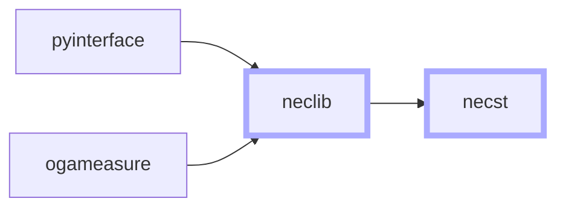
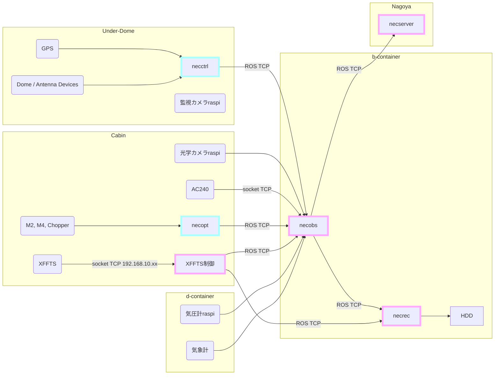
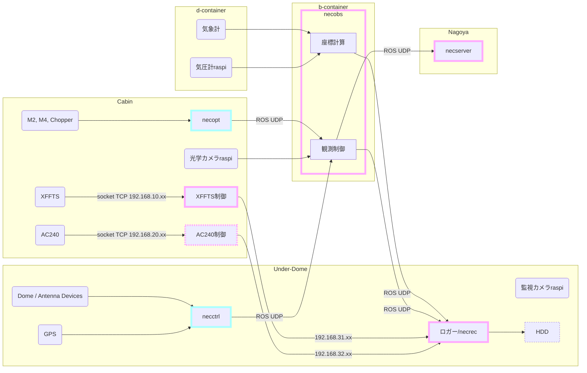
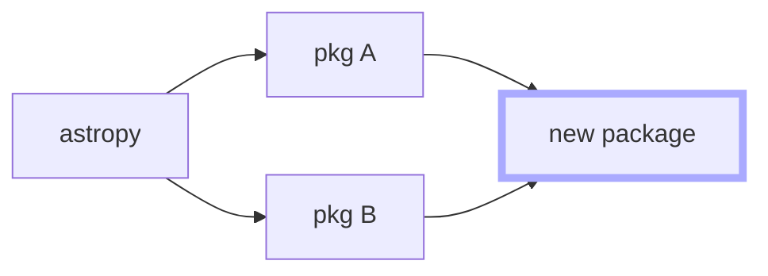

# NECST v4 Design Docs

July 28th, 2022  
Status: Draft  
Author: Kaoru Nishikawa

## Context and Scope

Controlling a telescope requires quite much computing power.
Core functionalities the controlling system should implement are the following.

- **Real-time** coordinate calculation, to cancel the sidereal motion
- **Communicate** with sensors, to know precise status of the devices
- **Restrict** who can control the telescope at the same time
- Auto-detect dangerous commands, and **interrupt** the running process
- **Record** the full log of the system status, alongside the observation results

The NANTEN2 Telescope was once controlled by original distributed control system, ***n2ctrl***, runs on RTLinux machine and implemented in ALPACA, a C/C++ based original language.
In 2011, the support for RTLinux comes to an end.
As NASCO project starts, data rate estimated to increase by factor of 120, which cannot be handled by old machines.
Computing power of consumer PCs dramatically improved then, so special operating system for real-time control wasn't required anymore, but it was still hard and risky to run all the processes in single machine.
In February 2015, a project to develop new control system, employing Python and ROS, has started.
This is the beginning of ***NECST***.

After implementing advanced observation functionalities, **NECST v2 is now installed on NANTEN2**.

On the other hand the 1.85-m telescope has started its scientific operation in 2011.
The control system employed C for server-side implementation, and Python for client-side then.
Starting in October 2018, the control system was replaced with NECST.

Currently **NECST v3 is installed on 1.85-m Telescope**.

The diverging system makes it hard to debug or refactor the implementation, though the system aims to high portability.
This would be a side effect of ROS package's high scalability, but the development process could, or rather should, certainly be improved.

The other problem is high network load.
Currently, NECST transfers spectral data from spectrometer to data logger via ROS network.
There are 3 reasons for this design:

- Put logger PC in easily accessible place (away from spectrometer)
- Make system more extensible by exposing full data, no matter it's generated or acquired
- Store all the data in one database

This problem should also be resolved while preserving the spirit of current design intact, via fundamental design change.

## Goals

- 分散システムの制約を補うアルゴリズムによる、**信頼性の高いリアルタイム制御・データ記録システム**の実現
- 単一の望遠鏡・計算機構成に特化しない、**汎用性の高い**フレームワークの構築
- 現地での**デバッグを最小限に**するテスト・シミュレーション環境の構築
- 環境構築が容易で、**直感的に操作**できるシステムの実現

## Non-Goals

- 直感的に操作できる GUI の実装
- GUI を備えたシミュレータ

以上の機能の実装は今回の開発では目標としない。
ただし、いずれも望遠鏡システムとして、またその開発のために必要な機能であり、今後検討すべきである。

前者はデスクトップアプリとして実装する場合 [Tauri](https://tauri.app/) や [Electron](https://www.electronjs.org/) といったフレームワークが考えられるが、ウェブアプリとしての実装が現実的かつ実用的と考える。
後者は [Gazebo Simulator](https://gazebosim.org/home) を使った実装が考えられる。

## Overview

NECST は以下のパッケージで構成する。

- [pyinterface](https://pypi.org/project/pyinterface) : Interface 製 PCI ボードのドライバ
- [ogameasure](https://pypi.org/project/ogameasure/) : デバイスとの通信
- [neclib](https://pypi.org/project/neclib) : NECST API
- [necst](https://github.com/necst-telescope/necst) : ROS system

pyinterface には Interface 社製の PCI ボードを制御するためのドライバ関数を集約する。

ogameasure には機器と通信し、コマンド送信やデータの読み出しを行うモジュールを集約する。

neclib は NECST に必要な全ての関数・オブジェクトを集約する。
このツール群は分散システムにおける通信遅延やデータ欠損に対処できるインターフェースを適宜実装する。
ただし、それを適切に扱うアルゴリズムは提供しない。
これが NECST に必要な各種演算の API となる。

necst は neclib に実装された API を呼び出し、ROS を使って連携させることでシステムを構築する。
また、リアルタイム制御における問題を neclib のインターフェースによって解決するアルゴリズムを実装する。
ROS が PyPI に公開された任意のライブラリを使うことを想定していないため、できる限り依存パッケージを減らす。
ここに実装されたユーザー向けの機能はコマンドラインでの実行をサポートする。

neclib, ogameasure, pyinterface は PyPI で最新版を入手できる状態とする。

## Network Design

制御のリアルタイム性やデータ保存の完全性に支障を来さぬよう、分光データの通信経路を隔離する。
ただし既存の望遠鏡における構造上の制約があるため、PC の配置を大幅に変更することは慎重に検討すべきである。

NANTEN2 望遠鏡におけるネットワーク構成と PC の配置の概略を以下に示す。

以下に NANTEN2 における新設計 (案) を示す。

分光データはロガー PC まで隔離された経路で転送し、そこに接続された HDD に記録する。
この部分はロガーを分光計制御用 PC にも起動し、ロガー PC 経由のデータとともに NAS に記録することも考えられる。

## Package Design

Python パッケージの開発には Dependency Hell の問題が付きまとう。
実際に astropy のバージョン 4.x はドキュメント作成ツールのバージョン不整合により Python 3.9 以上の環境へインストールできない。
そのため、パッケージの依存バージョンは正確に指定する必要がある。
このプロジェクトでは [Poetry](https://python-poetry.org/) を使用することでバージョン解決を行うが、先に述べた astropy のような問題は Poetry にも解決が困難である。
例えば astropy に依存した複数のパッケージ (pkg A, pkg B) に依存するパッケージ (new package) を開発する場合、プラグインを導入した上で数時間かけてバージョン解決を行う必要がある。

そのため、外部ライブラリに依存する実装はすべて neclib にまとめ、機能ごとに細分化したパッケージ化は行わない。
一方で neclib 内部については機能ごとに意味のあるサブパッケージ構造とする。

pyinterface, ogameasure, neclib はすでに Python パッケージとして PyPI に公開されており、今回の開発では純粋に機能を追加するアップデートを行う。
特に pyinterface と ogameasure は運用実績があるためメジャーアップデートは行わない。
一方 neclib には必要な機能がまだ揃っておらず完全に開発段階のパッケージのため、安定版 (v1.0.0) リリースの前にパッケージ構造の変更を含む大幅な仕様変更を行う可能性がある。

一方で necst はミドルウェアの変更もあり、大幅な設計変更を行う。
ROS 1 は Python スクリプトを直接実行するため、Python パッケージとしての実装が大幅に制限されていた。
一方で ROS 2 は `__init__.py` の読み込みや相対インポートなど、Python パッケージとしての機能を (確認した限り) 完全にサポートしている。
necst v4 では DRY 原則に基づき、これらの機能を適切に使用する。

また、これまで個別のパッケージとして実装されていたロガーや受信機関連のスクリプトも一つのパッケージにまとめる。
これは Python パッケージとしての機能を最大限活かして DRY 原則を徹底するとともに、分散したパッケージを管理する手間を省くことにもつながる。

このような大幅な変更を行うため、NECST は Docker を採用し、従来のシステムとは完全に隔離された環境として実装する。
この設計の具体的な目的は以下の通り。

- デバッグの長期化による観測・受信機試験の停滞、従来システムの実行環境の破損といったリスクの回避
- 環境構築を容易にする
- スクリプトのバージョン管理の徹底

## Implementation Design

全体に共通する実装方針として、docstring と型ヒントの記述を徹底する。
また関数は意味のある処理ごとに分割し、その意味を的確に表現する命名を行う。
これにより、スクリプトを実行したり一つひとつの処理を追わずとも使い方を調べることができ、またデバッグがしやすい実装となる。

また全てのパッケージでライセンスを明示し、完全にオープンソース化する。

### pyinterface

不足しているスクリプトの実装や可読性の向上程度の軽微な修正を行う。

### ogameasure

NANTEN2 で使用できるよう、不足しているスクリプトの実装を行う他は可読性の向上程度の軽微な修正にとどめる。

### neclib

前述のように ROS 2 は任意の外部ライブラリに依存することを想定していない。
そのため依存パッケージの管理ツールは制限されており、Poetry のようなバージョン解決機能はない。

これに対応するため、ROS を使用しない機能については neclib に集約し、Poetry によるバージョン解決とテストの徹底を行う。
一方で necst は neclib の関数と他 PC から送信されてきたデータとのバイパス、そして分散システムのエラー処理に徹する実装とする。

### necst

前提として、ROS 2 パッケージは Python のパッケージ構造をサポートしている。
そのため、necst は完全な Python パッケージとして構築する。

ROS 2 を使用する上で、スクリプトを直接実行することは想定しない。
つまり、`if __name__ == "__main__":` 節に処理を定義するのではなく、`if __name__ == "__main__": main(args)` のように実行できる `main` 関数を実装する。

上記の実装により、観測スクリプトをはじめとするユーザー向けのコードは全てコマンドラインでの実行をサポートする。
その際に必要なパラメータはコマンドライン引数として設定できるような実装とする。
また、これらのスクリプトは意図的にサブパッケージ構造を浅くする。
一方で望遠鏡の制御権限の管理など、ユーザーが直接使うことを想定せず完全に自動化された部分については core サブパッケージなどに秘匿する。

また遅延のあるコンソールでも操作しやすいシステムとするため、直感的かつ最小限の文字数で動作する CLI とする。

さらに複数の望遠鏡で使える汎用的なシステムとするため、環境変数や設定ファイルを最大限活用する。
こうして定義されたパラメータは necst のスクリプトが実行された時点、あるいはインポートされた時点で読み込む。

## Alternatives Considered

- データハンドリングと座標計算を別の PC で実行する
    負荷が大きすぎるようなら検討する。
    ただ最新の PC は4コア以上の CPU を搭載しているのがふつうであり、さほど心配することはない。
    (そのうち1スレッドの使用率が100\%に達していたとしても、それは PC の数を増やして解決する問題ではない)
- AC240 制御用の PC を用意する
    XFFTS が搭載するのはマイコンだが、AC240 には LINUX が走るコンピュータが搭載されている。
    そのため、そこでデータ処理のプログラムを実行すればよい。
