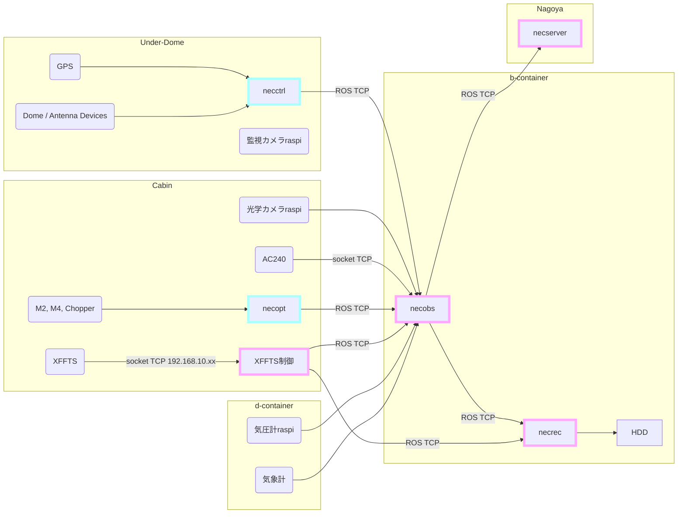
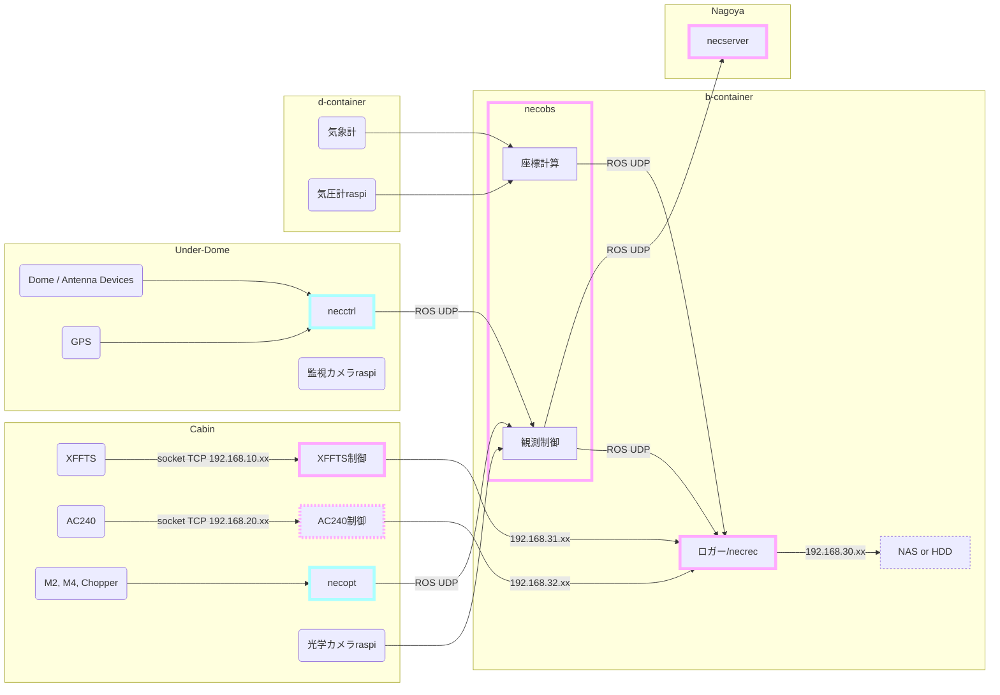

# NECST v4 Design Docs

July 21st, 2022  
Status: Draft  
Author: Kaoru Nishikawa

## Context and Scope

Controlling a telescope requires quite much computing power.
Core functionalities the controlling system should implement are the following.

- **Real-time** coordinate calculation, to cancel the sidereal motion
- **Communicate** with sensors, to know precise status of the devices
- **Restrict** who can control the telescope at the same time
- Auto-detect dangerous commands, and **interrupt** the running process
- **Record** the full log of the system status, alongside the observation results

The NANTEN2 Telescope was once controlled by original distributed control system, ***n2ctrl***, runs on RTLinux machine and implemented in ALPACA, a C/C++ based original language.
In 2011, the support for RTLinux comes to an end.
As NASCO project starts, data rate estimated to increase by factor of 120, which cannot be handled by old machines.
Computing power of consumer PCs dramatically improved then, so special operating system for real-time control wasn't required anymore, but it was still hard and risky to run all the processes in single machine.
In February 2015, a project to develop new control system, employing Python and ROS, has started.
This is the beginning of ***NECST***.

After implementing advanced observation functionalities, **NECST v2 is now installed on NANTEN2**.

On the other hand the 1.85-m telescope has started its scientific operation in 2011.
The control system employed C for server-side implementation, and Python for client-side then.
Starting in October 2018, the control system was replaced with NECST.

Currently **NECST v3 is installed on 1.85-m Telescope**.

The diverging system makes it hard to debug or refactor the implementation, though the system aims to high portability.
This would be a side effect of ROS package's high scalability, but the development process could, or rather should, certainly be improved.

The other problem is high network load.
Currently, NECST transfers spectral data from spectrometer to data logger via ROS network.
There are 3 reasons for this design:

- Put logger PC in easily accessible place (away from spectrometer)
- Make system more extensible by exposing full data, no matter it's generated or acquired
- Store all the data in one database

This problem should also be resolved while preserving the spirit of current design intact, via fundamental design change.

## Goals

- 単一の望遠鏡に特化しない、**汎用性の高い**フレームワークの構築
- **ネットワーク資源が適切に管理**され、かつ分光データにアクセス可能なシステムの実現
- 現地での**デバッグを最小限に**するテスト・シミュレーション環境の構築
- 環境構築が容易で、**直感的に操作**できるシステムの実現

## Non-Goals

- 直感的に操作できる GUI の実装
- GUI を備えたシミュレータ

以上の機能の実装は今回の開発では目標としない。
ただし、いずれも望遠鏡システムとして、またその開発のために必要な機能であり、今後検討すべきである。

前者はデスクトップアプリとして実装する場合 [Tauri](https://tauri.app/) や [Electron](https://www.electronjs.org/) といったフレームワークが考えられるが、ウェブアプリとしての実装が現実的かつ実用的と考える。
後者は [Gazebo Simulator](https://gazebosim.org/home) を使った実装が考えられる。

## Overview

NECST は以下のパッケージで構成する。

- [ogameasure](https://pypi.org/project/ogameasure/) : デバイスとの通信 (PCI ボードを含む)
- [neclib](https://pypi.org/project/neclib) : NECST API
- [necst](https://github.com/necst-telescope/necst) : ROS system

ogameasure にはデバイスドライバを含め、機器と通信するモジュールを集約する。
これには現在 pyinterface に実装されている関数群も含まれる。

neclib は他のデバイス (PC を含む) との通信を行わずに実現できる、NECST の全機能を集約する。
これが NECST に必要な各種演算の API となる。

necst は neclib に実装された API を呼び出し、ROS を使って連携させることでシステムを構築する。
ROS が PyPI に公開された任意のライブラリを使うことを想定していないため、できる限り依存パッケージを減らす。
ここに実装されたユーザー向けの機能はコマンドラインでの実行をサポートする。

## Network Design

制御のリアルタイム性やデータ保存の完全性に支障を来さぬよう、分光データの通信経路を隔離する。
ただし望遠鏡の構造上の制約があるため、PC の配置を大幅に変更することは慎重に検討すべきである。

NANTEN2 望遠鏡におけるネットワーク構成と PC の配置の概略を以下に示す。

以下に NANTEN2 における新設計 (案) を示す。

分光データはロガー PC まで隔離された経路で転送し、そこに接続された HDD に記録する。
この部分はロガーを分光計制御用 PC にも起動し、ロガー PC 経由のデータとともに NAS に記録することも考えられる。

また観測制御 PC (necobs) で行っていた処理を2台に分割し、負荷低減を図ることを検討する。

分光計制御 PC については負荷試験の後、1台の PC に統合する可能性がある。

## Package Design

ogameasure, neclib はすでに Python パッケージとして PyPI に公開されており、今回の開発では純粋に機能を追加するアップデートを行う。
特に ogameasure は運用実績があるためメジャーアップデートは行わない。
一方 neclib には必要な機能がまだ揃っておらず完全に開発段階のパッケージのため、安定版 (v1.0.0) リリースの前にパッケージ構造の変更を含む大幅な仕様変更を行う可能性がある。

一方で necst はミドルウェアの変更もあり、大幅な設計変更を行う。
ROS 1 は Python スクリプトを直接実行するため、Python パッケージとしての実装が制限されていた。
一方で ROS 2 は `__init__.py` の読み込みや相対インポートなど、Python パッケージとしての機能を (確認した限り) 完全にサポートしている。
necst v4 では DRY 原則に基づき、これらの機能を適切に使用する。

このような大幅な変更を行うため、NECST は Docker を採用し、従来のシステムとは完全に隔離された環境として実装する。
この設計の具体的な目的は以下の通り。

- 大幅な変更によるデバッグの長期化、従来システムの実行環境の破損といったリスクの回避
- 環境構築を容易にする
- スクリプトのバージョン管理の徹底

## Implementation Design

- ogameasure  
  - PCI ドライバを pyinterface から移植
  - 可読性の向上

---

- ROS パッケージの機能は最小限に、Pure-Python な機能はテストを徹底するため分離
- ROS パッケージの完全な Python パッケージ化
- 実行せずともデバッグが可能な、可読性の高いコードの実装
- 直感的かつ字数を最小限に抑えた CLI
- High-Level Interface の公開、Low-Level Interface の秘匿
- ライセンスを明示したオープンソース化

## Alternatives Considered
